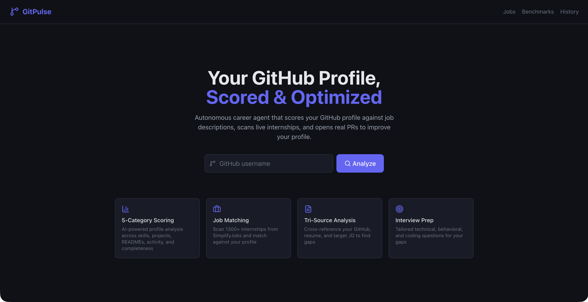

# GitPulse

**Autonomous GitHub career agent that scores profiles against job descriptions, scans live internships, and opens real PRs.**

<!-- Replace with actual screenshot -->


---

## Features

- **5-Category Profile Scoring** — AI-powered analysis across skills match, project relevance, README quality, activity level, and profile completeness (scored out of 100)
- **Live Internship Scanner** — Parses 1300+ listings from SimplifyJobs Summer 2026 with filtering by role, location, and visa sponsorship
- **Tri-Source Matching** — Cross-references your GitHub profile, resume (PDF/DOCX), and target job description to find gaps and contradictions
- **Autonomous PR Agent** — Generates improved READMEs and opens real PRs on your repos (safety-first: only README.md, only repos you own, always feature branches)
- **Company Benchmarking** — Compare your profile against intern cohorts at 10 companies (Salesforce, Google, Amazon, Meta, Stripe, etc.) with radar charts
- **Interview Prep Generator** — Tailored technical, behavioral, and coding questions based on your specific skill gaps
- **Progress Tracking** — Snapshot scores over time with delta analysis and trend charts
- **Chrome Extension** — Score any job listing from LinkedIn, Greenhouse, Lever, or Ashby with one click

## Tech Stack

| Layer | Technology |
|-------|-----------|
| Backend | Python 3.11, FastAPI, async httpx, PyGithub |
| AI | Anthropic Claude API (semantic scoring, JD analysis, recommendations) |
| Frontend | React 18, Vite, Tailwind CSS v4, Recharts |
| Data | SimplifyJobs GitHub repo (1300+ internships), GitHub REST + GraphQL APIs |
| Extension | Chrome Manifest V3 |
| Deployment | Railway (backend), Vercel (frontend) |

## Quick Start

### Prerequisites

- Python 3.11+
- Node.js 20+
- [Anthropic API key](https://console.anthropic.com/)
- [GitHub personal access token](https://github.com/settings/tokens) (with `repo` scope for PR features)

### Setup

```bash
# Clone
git clone https://github.com/tarundattagondi/GitPulse.git
cd GitPulse

# Backend
pip install -r requirements.txt
cp .env.example .env  # Edit with your API keys

# Frontend
cd frontend && npm install && cd ..
```

### Environment Variables

Create a `.env` file in the project root:

```
ANTHROPIC_API_KEY=sk-ant-...
GITHUB_TOKEN=ghp_...
CLAUDE_MODEL=claude-sonnet-4-5
```

### Run

```bash
# Terminal 1: Backend
uvicorn backend.app:app --reload

# Terminal 2: Frontend
cd frontend && npm run dev
```

Open [http://localhost:5173](http://localhost:5173) in your browser.

### Chrome Extension

See [docs/EXTENSION_INSTALL.md](docs/EXTENSION_INSTALL.md) for installation instructions.

## Live Demo

<!-- Replace with actual URLs after deployment -->
- **Frontend**: [https://gitpulse.vercel.app](https://gitpulse.vercel.app)
- **API**: [https://gitpulse-api.up.railway.app](https://gitpulse-api.up.railway.app)

## Architecture

<!-- Replace with actual diagram or see docs/ARCHITECTURE.md for Mermaid source -->
See [docs/ARCHITECTURE.md](docs/ARCHITECTURE.md) for the full system diagram, data flow, and component responsibilities.

## API Documentation

See [docs/API.md](docs/API.md) for every endpoint, request/response schemas, and curl examples.

## Deployment

See [docs/DEPLOYMENT.md](docs/DEPLOYMENT.md) for Railway, Vercel, and Chrome extension setup.

## Project Structure

```
GitPulse/
├── backend/
│   ├── app.py                    # FastAPI application (13 endpoints)
│   ├── config.py                 # Environment variables
│   ├── storage.py                # JSON file helpers
│   ├── services/
│   │   ├── analyzer.py           # Main orchestrator (fetch + score + snapshot)
│   │   ├── github_service.py     # Async GitHub API client (REST + GraphQL)
│   │   ├── scorer.py             # 5-category AI scorer
│   │   ├── jd_analyzer.py        # Job description parser
│   │   ├── matcher.py            # Profile-to-JD semantic matcher
│   │   ├── recommender.py        # Action plans and README rewrites
│   │   ├── job_board_scanner.py  # SimplifyJobs parser + cache
│   │   ├── pr_agent.py           # Autonomous PR agent (safety-first)
│   │   ├── progress_tracker.py   # Score snapshots and deltas
│   │   ├── resume_parser.py      # PDF/DOCX text extraction
│   │   ├── tri_match.py          # Tri-source cross-reference
│   │   ├── company_benchmarks.py # Cohort percentile comparison
│   │   └── interview_generator.py# Tailored interview questions
│   ├── routes/                   # Route handlers (wired in app.py)
│   ├── data/                     # Seed data + runtime JSON
│   └── tests/                    # Unit + integration tests
├── frontend/                     # React + Vite + Tailwind
│   ├── src/pages/                # 9 pages (Landing → History)
│   ├── src/components/           # 11 reusable components
│   └── src/services/api.js       # Axios API wrapper
├── extension/                    # Chrome Manifest V3 extension
├── docs/                         # Architecture, API, deployment docs
├── requirements.txt
├── Procfile                      # Railway
└── railway.json                  # Railway config
```

## License

MIT License. See [LICENSE](LICENSE) for details.

## Credits

Built by [Tarun Datta Gondi](https://github.com/tarundattagondi).

AI-powered by [Anthropic Claude](https://anthropic.com). Job data from [SimplifyJobs](https://github.com/SimplifyJobs/Summer2026-Internships).
