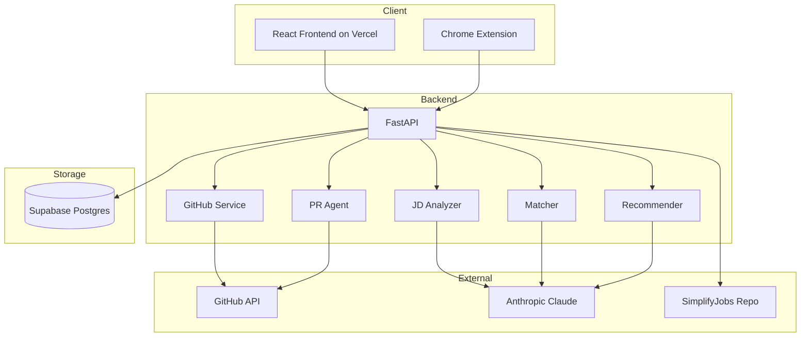

# GitPulse

An AI-powered GitHub career agent that scores profiles against job descriptions, scans live internships, and opens real pull requests to improve weak repos.

[Live demo](https://git-pulse-ten.vercel.app) | [Substack writeup](https://tarundatta.substack.com) | [Chrome extension](./extension/)


## What it does

Five capabilities:

1. Profile scoring against job descriptions using Claude for semantic analysis
2. Autonomous pull request agent that rewrites weak READMEs on your behalf
3. SimplifyJobs scanner that ranks every open Summer 2026 internship by fit
4. Tri-source matching across resume, GitHub, and JD
5. Chrome extension for one-click scoring on LinkedIn and Greenhouse

## Quick start

### Try it

Visit [git-pulse-ten.vercel.app](https://git-pulse-ten.vercel.app), enter a GitHub username, optionally paste a job description, click Analyze. Free, rate-limited to 5 analyses per IP per day without an API key.

### Run locally

Prerequisites: Python 3.11+, Node 18+, an Anthropic API key, a GitHub personal access token.

```bash
git clone https://github.com/tarundattagondi/GitPulse.git
cd GitPulse

# Backend
python -m venv venv
source venv/bin/activate
pip install -r requirements.txt

cp .env.example .env
# Edit .env with ANTHROPIC_API_KEY, GITHUB_TOKEN, SUPABASE_URL, SUPABASE_SERVICE_KEY

uvicorn backend.app:app --reload

# Frontend (separate terminal)
cd frontend
npm install
npm run dev
```

Frontend runs on http://localhost:5173, backend on http://localhost:8000.

## How it works

A user enters a GitHub username and optional job description. The backend fetches the profile, parses the JD if present, runs semantic matching with Claude, generates scored recommendations, and saves everything to Supabase. The frontend displays results. The Chrome extension calls the same backend from any job posting page.

### Architecture



### Data flow for a single analysis

1. Client sends POST to `/api/analyze/{username}` with `jd_text` in body
2. Backend runs GitHub fetch and JD analysis in parallel using `asyncio.gather`
3. GitHub service fetches profile, 15 most recent repos, READMEs, languages, commit activity across 90 days
4. JD analyzer extracts required skills, preferred skills, tools, role category as structured JSON
5. Matcher compares profile to JD semantically, returns per-category scores with reasoning
6. Recommender generates priority actions, one full README rewrite, and a 30-day improvement plan
7. Backend saves full analysis and a progress snapshot to Supabase
8. Client renders results

Typical time: 45-75 seconds for a warm request. First request after idle can take 90 seconds due to Railway cold start.

## Tech stack

| Layer | Technology | Purpose |
|-------|-----------|---------|
| Frontend | React 18, Vite, Tailwind CSS v4, Recharts, React Router | Dashboards, forms, charts |
| Backend | Python 3.11, FastAPI, httpx, Pydantic | API, async orchestration |
| AI | Anthropic Claude (Sonnet 4.5) | JD parsing, semantic matching, recommendations |
| Data sources | GitHub REST + GraphQL, SimplifyJobs repo | Profile and job data |
| Storage | Supabase Postgres | Analyses, snapshots, PR logs, rate limits |
| Git ops | PyGithub | Opening pull requests on user repos |
| Deployment | Railway (backend), Vercel (frontend) | Production hosting |
| Extension | Manifest V3, vanilla JS | Chrome extension |

## Scoring rubric

Five categories totaling 100 points:

| Category | Weight | What it measures |
|----------|--------|-----------------|
| Skills Match | 40 | Semantic overlap between repo languages/topics/READMEs and JD requirements |
| Project Relevance | 25 | Depth and quality of projects relative to the role's domain |
| README Quality | 15 | Deterministic checklist: headings, install steps, code examples, badges, usage |
| Activity Level | 10 | Log-scaled count of commits in the last 90 days |
| Profile Completeness | 10 | Presence of name, bio, location, company, avatar |

When no JD is provided, the scorer switches to profile audit mode. Skills Match becomes Skills Profile (scored against general 2026 market demand). Project Relevance becomes Project Quality (scored on depth and originality, not JD fit).

## Project structure

```
GitPulse/
├── backend/
│   ├── app.py                    FastAPI app, CORS, rate limiting
│   ├── config.py                 Environment variables
│   ├── storage.py                Supabase client wrapper
│   ├── services/
│   │   ├── github_service.py     GitHub REST + GraphQL calls
│   │   ├── jd_analyzer.py        JD parsing with Claude
│   │   ├── matcher.py            Profile vs JD semantic match
│   │   ├── scorer.py             Five-category scoring
│   │   ├── recommender.py        Recommendations and README rewrites
│   │   ├── pr_agent.py           PyGithub pull request creation
│   │   ├── job_board_scanner.py  SimplifyJobs parser with cache
│   │   ├── progress_tracker.py   Snapshot history and deltas
│   │   ├── company_benchmarks.py Cohort comparison (10 companies)
│   │   ├── resume_parser.py      PDF/DOCX text extraction
│   │   ├── tri_match.py          Three-source cross-reference
│   │   └── interview_generator.py Interview prep questions
│   └── tests/
├── frontend/
│   └── src/
│       ├── pages/                Landing, Loading, Results, JobBoard, etc.
│       ├── components/           MatchGauge, ScoreBreakdown, BenchmarkRadar, etc.
│       └── services/api.js       Axios wrapper
├── extension/                    Chrome extension (Manifest V3)
├── docs/                         ARCHITECTURE.md, API.md, DEPLOYMENT.md
├── Procfile                      Railway start command
├── railway.json                  Railway build config
└── requirements.txt
```

## API endpoints

Full Swagger documentation is auto-generated at `/docs` when the backend is running.

| Method | Path | Purpose |
|--------|------|---------|
| POST | `/api/analyze/{username}` | Full analysis with scores and recommendations |
| GET | `/api/analysis/{username}/latest` | Retrieve most recent saved analysis |
| GET | `/api/analyze/{username}` | Profile audit (no JD, GET shortcut) |
| GET | `/api/progress/{username}` | Historical score snapshots |
| POST | `/api/pr/preview` | Preview a README rewrite without opening a PR |
| POST | `/api/pr/open` | Open a real PR on a user's repo |
| POST | `/api/tri-match` | Compare resume + GitHub + JD (multipart form) |
| GET | `/api/jobs` | Browse SimplifyJobs listings with filters |
| POST | `/api/scan-jobs` | Async job scan with profile matching |
| POST | `/api/interview-prep` | Generate gap-targeted interview questions |
| GET | `/api/benchmark/{username}/{company}` | Compare profile to company cohort |
| GET | `/api/benchmark/companies` | List available benchmark companies |
| GET | `/api/warmup` | Keep Railway container warm |

## Deployment

See [docs/DEPLOYMENT.md](docs/DEPLOYMENT.md) for full instructions. Summary:

- Backend deploys from the repo root to Railway, which reads `railway.json` and `Procfile`
- Frontend deploys from `/frontend` to Vercel with `VITE_API_BASE_URL` pointing at the Railway URL
- Database schema runs in Supabase's SQL editor (tables: analyses, snapshots, cached_jobs, pr_log, rate_limits, company_benchmarks)
- Chrome extension loads unpacked from `/extension` (see [docs/EXTENSION_INSTALL.md](docs/EXTENSION_INSTALL.md))

Required environment variables:

```
ANTHROPIC_API_KEY=sk-ant-...
GITHUB_TOKEN=ghp_...
CLAUDE_MODEL=claude-sonnet-4-5
SUPABASE_URL=https://xxx.supabase.co
SUPABASE_SERVICE_KEY=eyJ...
```

## Design decisions

**Semantic matching over keyword matching.** Claude reads READMEs and repo metadata, not just topic tags. A repo with AWS Lambda code but no "AWS" tag still scores correctly for a cloud role.

**Local JSON to Supabase migration mid-build.** Started with JSON files for speed. Railway's ephemeral filesystem reset every deploy, losing all data. Migrated to Supabase with `storage.py` as the single abstraction layer. If the database changes, only that file changes.

**Parallel API calls.** GitHub fetch and JD analysis run concurrently with `asyncio.gather` since they have no dependency. The matcher runs after both complete. This saves 10-15 seconds per analysis.

**One full README rewrite, not N.** The recommender generates one publication-ready README for the weakest repo, then 2-sentence notes for up to three more. Generating full READMEs for every weak repo adds 20-30 seconds per extra Claude call. Users can re-run to cycle through repos.

**Chrome extension reuses the same backend.** No duplicate logic. The extension is a second client, like the web frontend. Manifest V3 with `chrome.scripting.executeScript` grabs JD text from any page.

**PR agent safety rules.** Five hard constraints: only touches README.md, never force-pushes, never pushes to the default branch, never PRs on repos the token does not own, always creates a timestamped feature branch. Every attempt is logged to Supabase.

## Known limitations

- GitHub private repos not supported (public REST API only)
- Rate limit: 5 analyses per IP per day without a bring-your-own Anthropic key
- First analysis after 15+ minutes idle takes 60-90 seconds due to Railway cold start
- SimplifyJobs scanner scope is Summer 2026 only; needs manual update for future cycles
- Company benchmarks are seed data for 10 companies; more would require real hiring data

## Roadmap

- Shareable result URLs with permanent links to specific analyses
- Weekly email digest when score changes or matching jobs appear
- GitHub OAuth for scoring private repos
- Real-time analysis streaming instead of poll-based loading
- Cohort benchmarks backed by aggregate hiring data

## Contributing

PRs welcome. Please:

1. Open an issue first for anything larger than a typo fix
2. Run `pytest` before submitting
3. Keep writing style direct and specific

## License

MIT. See [LICENSE](LICENSE).

## Credits

Built by [Tarun Datta Gondi](https://github.com/tarundattagondi), MS Computer Science at George Mason University.

Writeup: [tarundatta.substack.com](https://tarundatta.substack.com)
