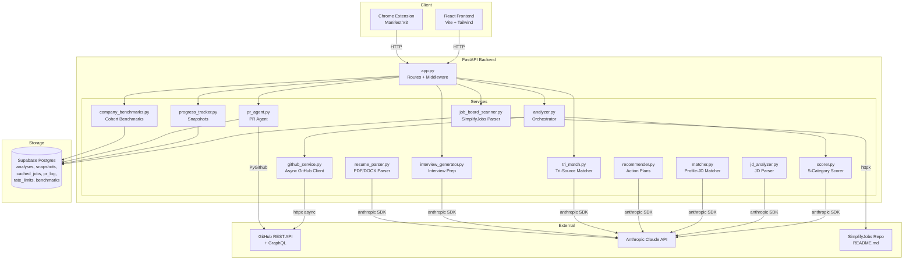
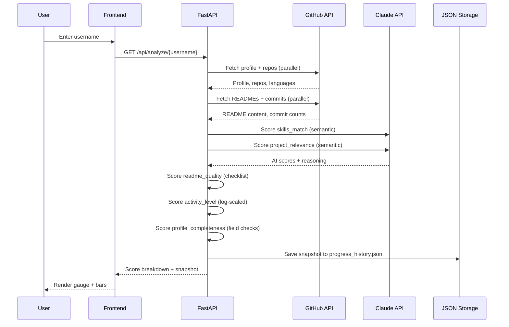
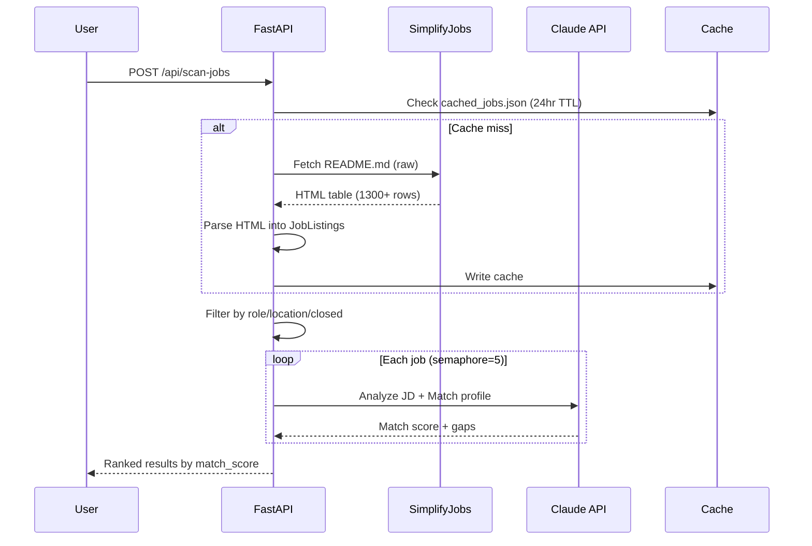
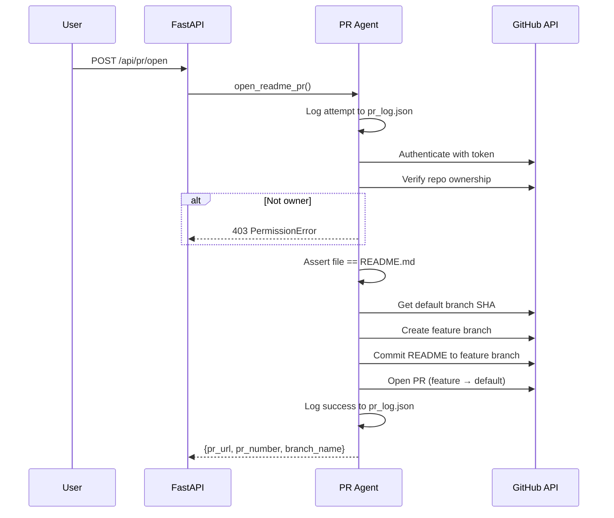

# GitPulse Architecture

## System Diagram

## Data Flow

### Profile Analysis Flow

### Job Matching Flow

### PR Agent Safety Flow

## Component Responsibilities

### Services

| Service | Responsibility | External Deps |
|---------|---------------|---------------|
| `analyzer.py` | Orchestrates fetch → score → snapshot pipeline | github_service, scorer, progress_tracker |
| `github_service.py` | Async GitHub data fetching (REST + GraphQL) | GitHub API via httpx |
| `scorer.py` | 5-category scoring (40+25+15+10+10=100) | Claude API for skills_match + project_relevance |
| `jd_analyzer.py` | Parses JD text into structured JSON | Claude API |
| `matcher.py` | Semantic profile-to-JD matching | Claude API |
| `recommender.py` | Generates projects, README rewrites, 30-day plans | Claude API |
| `job_board_scanner.py` | Fetches/parses/caches SimplifyJobs listings | SimplifyJobs repo via httpx |
| `pr_agent.py` | Generates README improvements, opens PRs | GitHub API via PyGithub, Claude API |
| `progress_tracker.py` | Saves/retrieves score snapshots, computes deltas | JSON file storage |
| `resume_parser.py` | Extracts text from PDF/DOCX, parses with AI | pypdf, python-docx, Claude API |
| `tri_match.py` | Cross-references GitHub + resume + JD | Claude API |
| `company_benchmarks.py` | Compares user vs company cohort averages | Seed JSON data |
| `interview_generator.py` | Generates tailored interview prep material | Claude API |

### Scoring Weights

| Category | Points | Method |
|----------|--------|--------|
| Skills Match | 40 | Claude semantic comparison against market/JD |
| Project Relevance | 25 | Claude semantic analysis of project quality |
| README Quality | 15 | Checklist (headings, code blocks, install, badges, usage) |
| Activity Level | 10 | log₂(commits_90d + 1), capped at 10 |
| Profile Completeness | 10 | 2 pts each: name, bio, location, company/blog, avatar |

### Rate Limiting

| Tier | Limit | Scope |
|------|-------|-------|
| Unauthenticated | 5 requests/day per IP | All `/api/*` analysis endpoints |
| With `X-Anthropic-Key` header | Unlimited | All endpoints |
| GitHub API (with token) | 5,000 requests/hour | GitHub data fetching |
| GitHub API (without token) | 60 requests/hour | GitHub data fetching |
